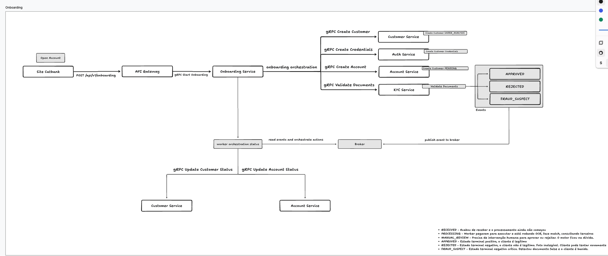

# Gobank

A digital bank for studying

## Services
- [ms-api-gateway](./ms-api-gateway/README.md)
- [ms-onboarding](./ms-onboarding/README.md)
- [ms-auth](./ms-auth/README.md)
- [ms-customer](./ms-customer/README.md)
- [ms-account](./ms-account/README.md)
- [ms-kyc](./ms-kyc/README.md)

## Módulos
- [contracts](./contracts/README.md)

## Onboarding Overview

## Working in progress
### Transaction 
A Transaction representa o fato que aconteceu. Registra a intenção e o contexto do movimentação do dinheiro. Quem mandou dinheiro para quem e quando, por qual motivo?

- ID
- Tipo (Pix, TED, DOC, Estorno, Cartão, Cartão de cédito)
- Valor total
- Status (Pendente, concluido, falhou)
- Descrição
- Timestamp

### AccountEntry
Cada Transaction gera duas ou mais AccountEntry. Ela representa o impacto real no saldo de uma conta específica. Partidas dobradas, Sai de uma Account (Debito) e entra em outra (Crédito). É o Ledger.

 - ID
 - TransactionID
 - AccountID
 - Type (credito ou débito)
 - Amount
 - timestamp

